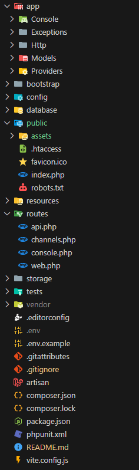

# Imprime-mas Backend

Este es un proyecto de Imprime-mas

## Descripcion

En este proyecto se encontraran todos los endpoints para usar con el proyecto de Imprime-mas y se usaran para conectar con el front-end

## Estructura del proyecto



- ***app***: A esta altura encontraras la carpeta **Http/Controllers** en la cual encontraras toda la logica del back-end y tambien encontraras la carpeta **Http/Models** en la cual encontraras los modelos para la coneccion de la base de datos.
- ***public***: A esta altura encontraras la carpeta **assets** donde estaran los recursos de imagenes.
- ***routes***: A esta altura encontraras el archivo **api.php** donde encontraras las url de todas las API´s

## Dependencias principales

-   <a href="https://windows.php.net/download#php-8.3">
    <span style="color:orange">
        PHP 8.1.X (Dando entender que X sea cualquier número)
    </span>
    </a> 
-   <a href="https://laravel.com/">
    <span style="color:orange">
        Laravel 10
    </span>
    </a>
-   <a href="https://getcomposer.org/">
    <span style="color:orange">
        Composer
    </span>
    </a>


## Configuracion del entorno de desarrollo


### Instalar dependencias

1. Usa Composer para instalar las dependencias del proyecto. Utiliza el siguiente comando:

```
composer install
```

2. Verifica la instalación de dependencias asegurandote de que todas las dependencias estén correctamente instaladas. Utiliza el siguiente comando:

```
composer update
```

3. Asegúrate de que el archivo de autoload de Composer esté correctamente generado. Utiliza el siguiente comando:

```
composer dump-autoload
```

4. Asegúrate de que Laravel Sanctum esté instalado en tu proyecto, si no lo esta entonces lo puedes instalar utilizando el siguiente comando:

```
composer require laravel/sanctum
```

### Limpiar la cache

A veces, las configuraciones de caché pueden causar problemas. Puedes limpiar la caché de configuración con:

```
php artisan config:cache
php artisan config:clear
php artisan cache:clear
php artisan route:clear
```

### Configurar el archivo .env

Copia y pega el archivo dejando la copia solo con el nombre de **.env**:

```
.env.example
```

y cambia las credenciales de la base de datos segun como lo tengas configurado.

### Establecer el APP_KEY

Asegúrate de establecer APP_KEY, que es la clave de aplicación. Puedes generarla usando el siguiente comando:

```
php artisan key:generate
```

### Finalmente corre el servidor

Para correr el servidor de desarrollo puedes usar el servidor de desarrollo incorporado en Laravel para ejecutar la aplicación localmente:

```
php artisan serve
```

## Nota

### Ten en consideracion lo siguiente

- La terminal que se ejecuta con el comando de ***php artisan serve*** siempre debe estar abierta ya que si se cierra el proyecto no funcionara.
- Para verificar que el servidor este arriba solo basta con darle click al lick que te aparece en consola o bien abriendo el localhost desde tu navegador.
- Todos los endpoint los podras consumir desde postman o algun otro gestor de API´s para que puedas verlas.


